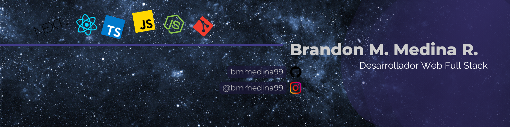

---

🧠 Analítico, 📊 metódico y 💡 resolutivo.

📚 Con más de 2 años de dedicación al aprendizaje autodidacta y perfeccionamiento en la creación de soluciones tecnológicas. 🎓💻

🚀 Especializado en TypeScript, pero con experiencia en otros lenguajes y tecnologías web. 💼🔧

🎓 Capacidad de aprendizaje rápido y adaptabilidad a nuevos entornos. 🌱🔄

---

### Frontend

&nbsp;&nbsp;
&nbsp;&nbsp;
&nbsp;&nbsp;
&nbsp;&nbsp;

### Backend

&nbsp;&nbsp;
&nbsp;&nbsp;
&nbsp;&nbsp;
&nbsp;&nbsp;

### Base de datos

&nbsp;&nbsp;
&nbsp;&nbsp;
&nbsp;&nbsp;
&nbsp;&nbsp;

### Herramientas

&nbsp;&nbsp;
&nbsp;&nbsp;
&nbsp;&nbsp;
&nbsp;&nbsp;
