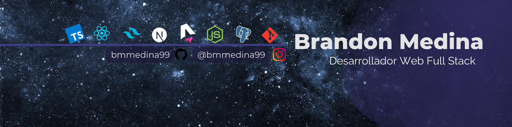

---

🧠 Analítico, 📊 metódico y 💡 resolutivo.

+2 años de trabajo dedicado a aprender por cuenta propia y mejorar en el desarrollo de soluciones tecnológicas.

Especializado en TypeScript, aunque también trabajo con diversos lenguajes y tecnologías web.

Habilidad para aprender rápidamente y capacidad de adaptarse fácilmente a nuevos entornos.

---

### Frontend

### Backend

### Base de datos

### Herramientas

