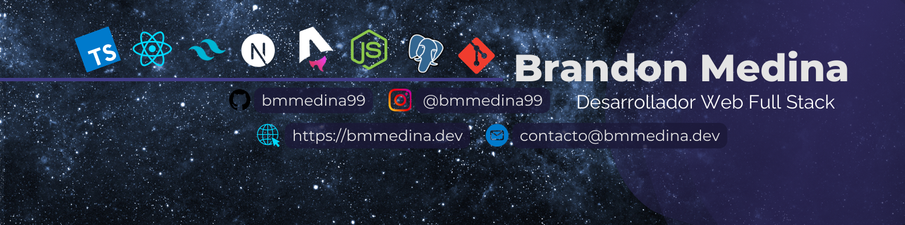

---

Desarrollador Web Full Stack con más de 3 años de experiencia especializado en Next.js, Astro, React y Node.js. Durante mi trayectoria, he desarrollado proyectos como el sitio web para Gray Gorilla Fitness y automatizado tareas con Python.

Disfruto investigando y trabajando de forma independiente; no obstante, aprecio el trabajo colaborativo. Actualmente, superviso y coordino operadores en un entorno técnico, garantizando la continuidad del servicio.

Si tuviera que describirme en pocas palabras, diría que soy analítico, metódico y resolutivo. Fuera del ámbito laboral, me apasionan el ajedrez y la música clásica, aficiones que potencian mis habilidades blandas.

---

### Frontend

### Backend

### Base de datos

### Herramientas

